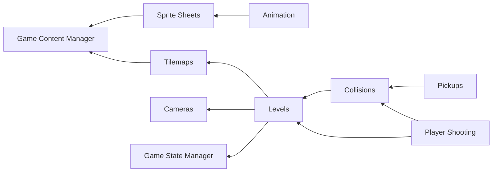

# Game Plan

The following is a high-level list of systems and features that would need to be implemented to get an MVP version of the game. The gameplay design goal is to implement a twin-stick top-down shooter, similar to the game [Nuclear Throne](https://www.gog.com/en/game/nuclear_throne).

## Game State Manager
- Initially can just ba a simple container of game states that can be switched, then only one state will have Update/Draw dispatched to it
- Would need an `IGameState` interface that will then be implemented by the different state classes
- States need to have methods for `Load` and `Unload` that take a `ContentManager`
- This will be enough to implement the initial basic game states:
    - Main Menu
    - In-Game
    - Pause Menu
- Can later be extended to a simple stack-based container
    - Would allow each level of the stack to decide whether to propagate Update/Draw to lower level states

## Custom Game Content Manager
- Subclass of `Microsoft.Xna.Framework.Content.ContentManager` that we can extend to support loading of custom assets, since it's fairly limited out of the box
- Can then replace the instance created out of the box in `GameMain` to be used by the rest of the game systems
- Many of the following features assume this will be implemented first to simplify things

## Spritesheet Loading and Rendering
- Add support for loading in sprite sheets with fixed cell sizes
- Easiest way would be to support the JSON + PNG export format of [Aseprite](https://www.aseprite.org)

## Animation Support
- Basic sprite animation system based on a sprite sheet with defined frame ranges
- [Aseprite](https://www.aseprite.org) can be used to make animations and export as sprite sheet frames

## Tilemap Loading and Rendering
- Add support for loading a tilemap that can be used to design the level(s) for the game
- Best approach would be to support loading of [Tiled Maps](https://doc.mapeditor.org/)
- Initially just support loading and rendering regular square tiles, but later we can extend to add support for collisions and non-tile entities

## Camera System
- Create a basic camera system that can follow the `Player` entity
- Active camera would then be used by `Renderer` to change the transform `Matrix` passed to the beginning of the `SpriteBatch`

## Level System
- Create a new `Level` class that will be part of the In-Game state and contains the `Player`, the camera, the tilemap and any other entities in the game
- `Renderer` should then be able to fetch renderable objects from the `Level` instead of having to maintain a list
- Ideally the contents of a level should also be something load-able using the game content manager

## Collision Manager
- Create a new `ICollideable` interface that will be used by entities that can collide and accept collisions
- Create a new collision manager, downstream from the `Level` that will be updated before all other entities, and will handle checking whether collisions have occured, calling some form of `OnCollision` callback defined in the interface
- Initially this can be a simple brute-force all-to-all check for each pair of collideables, but some type of spatial hashing will probably become necessary

## Player Shooting
- Player would need to be able to shoot projectile entities which travel in a straight line with a limited lifetime
- Shooting speed would need to be taken into account to avoid letting the player spam the fire button
- Input manager will have to be extended in two ways:
    - To define a 'Fire' input button for both keyboard and gamepad inputs
    - To expose an aim direction vector that will either be taken from the gamepad right stick or calculated from mouse cursor position relative to the window center

## Player Pickups
- We'll need some form of simple pickups items (e.g. ammo) that the player will pickup when colliding (walking over)

# WIP Dependency Graph

